# Behaviorial Cloning Project

Overview
---
This repository contains starting files for the Behavioral Cloning Project.

In this project, you will use what you've learned about deep neural networks and convolutional neural networks to clone driving behavior. You will train, validate and test a model using Keras. The model will output a steering angle to an autonomous vehicle.

We have provided a simulator where you can steer a car around a track for data collection. You'll use image data and steering angles to train a neural network and then use this model to drive the car autonomously around the track.

To meet specifications, the project will require submitting five files: 
* model.py (script used to create and train the model)
* drive.py (script to drive the car - feel free to modify this file)
* model.h5 (a trained Keras model)
* a report writeup file (either markdown or pdf)
* video.mp4 (a video recording of your vehicle driving autonomously around the track for at least one full lap)

* run1.mp4 (a video recording of lake full lap)
* run2.mp4 (a video recording of jungle full lap)
Simulator shown as following:

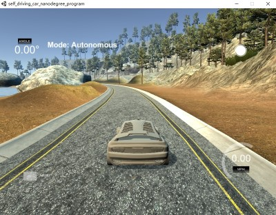
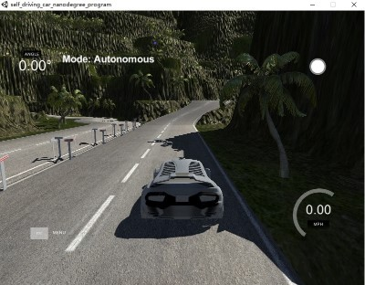
<center>Figure 1.Simulation</center>


---
## Step 0: Read Config Data from .csv file


```python
import csv
import cv2
import numpy as np
from itertools import islice 
import matplotlib.image as mpimg
from matplotlib import pyplot as plt 

def readindexfromconfig(path):
    """"
    read index from config file
    
    Arguments:
        path: source csv file
    """
    temp_lines = []
    with open(path) as csvfile:
        reader = csv.reader(csvfile)
        for line in islice(reader, 1, None):
            temp_lines.append(line)
    return temp_lines
```


```python
lines = readindexfromconfig('./data/driving_log.csv')
# lines = readindexfromconfig('./windows_sim/data/driving_log.csv')

print("Total record length: {}".format(len(lines)))
```

    Total record length: 8036
    

### Random show images from left,center,right viewpoint


```python
def readfromfile(line,sourcepathindex='./data/IMG/',correction = 0.25):
    img_center_path = sourcepathindex + line[0].split('/')[-1]
    img_left_path = sourcepathindex + line[1].split('/')[-1]
    img_right_path = sourcepathindex+ line[2].split('/')[-1]

    img_center = mpimg.imread(img_center_path)
    img_left = mpimg.imread(img_left_path)
    img_right = mpimg.imread(img_right_path)

    steering_center = float(line[3])
    steering_left = steering_center + correction
    steering_right = steering_center - correction
    
    return img_left,img_center,img_right,steering_left,steering_center,steering_right
    
def randomshowviewpoint(lines,sourcepathindex='./data/IMG/'):
    line = lines[np.random.randint(len(lines))]
    
    img_left,img_center,img_right,steering_left,steering_center,steering_right = readfromfile(line,sourcepathindex)
    
    plt.figure(figsize=(16, 16))
    plt.subplot(1,3,1)
    plt.imshow(img_left)
    plt.title('Left Image,steering angle.{:.3f}'.format(steering_left))
    plt.yticks([])
    plt.xticks([])
    
    plt.subplot(1,3,2)
    plt.imshow(img_center)
    plt.title('Center Image,steering angle.{:.3f}'.format(steering_center))
    plt.yticks([])
    plt.xticks([])
    
    plt.subplot(1,3,3)
    plt.imshow(img_right)
    plt.title('Right Image ,steering angle.{:.3f}'.format(steering_right))
    plt.yticks([])
    plt.xticks([])
```


```python
randomshowviewpoint(lines)
```


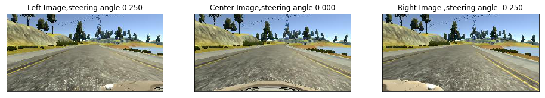


### Generate images and steering angles dataset


```python
def generatedataset(lines,sourcepathindex='./data/IMG/'):
    car_images =[]
    steering_angles =[]
    
    for line in lines:
        img_left,img_center,img_right,steering_left,steering_center,steering_right = readfromfile(line,sourcepathindex)
    
        car_images.append(img_center)
        car_images.append(img_left)
        car_images.append(img_right)
    
        steering_angles.append(steering_center)
        steering_angles.append(steering_left)
        steering_angles.append(steering_right)
    
    X_image = np.array(car_images)
    y_label = np.array(steering_angles)
    return X_image,y_label
```


```python
# X_train,y_train = generatedataset(lines)

# print(X_train.shape)
# print(y_train.shape)
```

## Step 1:Data Augument Data Set function


```python
import cv2
from skimage import io, color, exposure, transform
from skimage.util import random_noise


def gamma_correction(img, correction):
    """"
    Gamma correction function
    
    """
    img = img/255.0
    img = cv2.pow(img, correction)
    return np.uint8(img*255)

def gammaImage(img,steering,gammarate= 0.8):
    """"
    Gamma correction function as expection of brightness lighting conditions
    
    """
    HSV = cv2.cvtColor(img, cv2.COLOR_RGB2HSV)   
#     HSV[:,:,2] = gamma_correction((HSV[:,:,2]),2)
    HSV[:,:,2] = gamma_correction((HSV[:,:,2]),(2*gammarate * np.random.random_sample(1) + 1-gammarate))
    img = cv2.cvtColor(HSV, cv2.COLOR_HSV2RGB )
    return img,steering

def gaussian_blur(img,steering,kernel_size=3):
    """"
    Gaussian blur function as expection of motion-blur
    
    """
    return cv2.GaussianBlur(img, (kernel_size, kernel_size), 0),steering

def gaussian_noise(img,steering):
    """"
    Gaussian noise function as expection of noise
    
    """
    var = 0.01*np.random.random_sample(1)
    return np.uint8(255*random_noise(img/255, mode="gaussian",var=var)),steering

def random_erase(img,steering, hlimt=90,wlimit=90):
    """"
    Gaussian erase function as expection of occlusions or physical damage
    
    """
    imgshape = img.shape
    h = np.random.randint(0, hlimt)
    w = np.random.randint(0, wlimit)
    x1 = np.random.randint(0, imgshape[0] - h)
    y1 = np.random.randint(0, imgshape[1] - w)
    cropimg =np.copy(img)
    cropimg[x1:x1+h, y1:y1+w,0] = 127
    cropimg[x1:x1+h, y1:y1+w,1] = 127
    cropimg[x1:x1+h, y1:y1+w,2] = 127
    return cropimg,steering

def image_flip(image,steering):
    image,steering=cv2.flip(image,1),steering*-1.0
    return image,steering

def image_trans(image, steering,trans_range = 100):
    """ Returns translated image and 
    corrsponding steering angle.
    """
    w = image.shape[0]
    h = image.shape[1]
    tr_x = trans_range * (np.random.uniform() - 1.0/ 2)
    steering = steering + tr_x / trans_range  * (trans_range/w)
    tr_y = 0
    M = np.float32([[1, 0, tr_x], [0, 1, tr_y]])
    image = cv2.warpAffine(image, M, (h,w))
    return image, steering
```


```python
def showimagelabel(image,label):
    plt.imshow(image)
    plt.title('Image,steering angle.{:.3f}'.format(label))
    plt.yticks([])
    plt.xticks([])
```

### Original image taken from dataset


```python
image,label = generatedataset(lines[0:1])

print(image.shape)
print(label.shape)

testimage = image[1]
testlabel = label[1]

showimagelabel(testimage,testlabel)
```

    (3, 160, 320, 3)
    (3,)
    


### flip function test


```python
imageflip,labelflip = image_flip(testimage,testlabel)
showimagelabel(imageflip,labelflip)
```


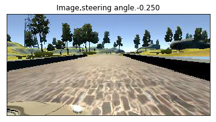


### gammaImage function test 


```python
imagegramma,labelgramma = gammaImage(testimage,testlabel)
showimagelabel(imagegramma,labelgramma)
```


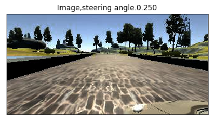


###  gaussian_blur


```python
imageblur,labelblur = gaussian_blur(testimage,testlabel)
showimagelabel(imageblur,labelblur)
```


### gaussian_noise


```python
imagenoise,labelnoise = gaussian_noise(testimage,testlabel)
showimagelabel(imagenoise,labelnoise)
```


### random_erase


```python
imageearse,labelearse = random_erase(testimage,testlabel)
showimagelabel(imageearse,labelearse)
```


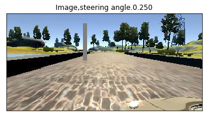


### image_trans


```python
imagetrans,labeletrans = image_trans(testimage,testlabel)
showimagelabel(imagetrans,labeletrans)
```


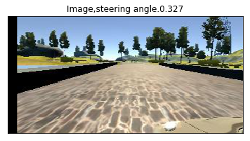


### Augument dataset combination


```python
def DataAugumentProcess(imgbatch,labelbatch,gammarate = 0.5,blurrate = 0.5,randomeraserte=0.5,randomtrans=0.4):
    """"
    Data Augumention Process function
    
    """
    car_images = []
    steering_angles = []
            
    for batch_image,batch_label in zip(imgbatch,labelbatch):
        img = batch_image
        label = batch_label
        if(np.random.random_sample(1) < gammarate):
            img,label = gammaImage(img,label)
        
        if(np.random.random_sample(1) < blurrate):
            img,label = gaussian_blur(img,label)
        
        if(np.random.random_sample(1) < randomeraserte):
            img,label = random_erase(img,label)
        
        if(np.random.random_sample(1) < randomtrans):
            img,label = image_trans(img,label)
            
        img,label = gaussian_noise(img,label)
        
        car_images.append(img)
        steering_angles.append(label)
        
        imageflip,labelflip = image_flip(batch_image,batch_label)
        img = imageflip
        label = labelflip
        
        if(np.random.random_sample(1) < gammarate):
            img,label = gammaImage(img,label)
        
        if(np.random.random_sample(1) < blurrate):
            img,label = gaussian_blur(img,label)
        
        if(np.random.random_sample(1) < randomeraserte):
            img,label = random_erase(img,label)
        
        if(np.random.random_sample(1) < randomtrans):
            img,label = image_trans(img,label)
        
        car_images.append(img)
        steering_angles.append(label)
    
    X_image = np.array(car_images)
    y_label = np.array(steering_angles)
    
    return X_image,y_label
```

### Augument dataset combination test


```python
X_train_test,y_train_test = DataAugumentProcess(image,label)

print(X_train_test.shape)
print(y_train_test.shape)

showimagelabel(X_train_test[4],y_train_test[4])
```

    (6, 160, 320, 3)
    (6,)
    


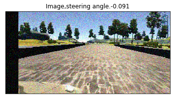


### Cropping function


```python
def croppingfunction(img,top_crop=70, bottom_crop=25,left_crop=0, right_crop=0):
    w = img.shape[0]
    h = img.shape[1]

    print(img.shape)
    plt.figure(figsize=(16, 16))
    plt.subplot(1,2,1)
    plt.imshow(img)
    plt.title('Augument Original Image')
#     plt.yticks([])
#     plt.xticks([])

    plt.subplot(1,2,2)
    plt.imshow(img[w-top_crop:w-bottom_crop, left_crop:h-right_crop])
    plt.title('Cropped Image')
#     plt.yticks([])
#     plt.xticks([])
```


```python
croppingfunction(X_train_test[4])
```

    (160, 320, 3)
    


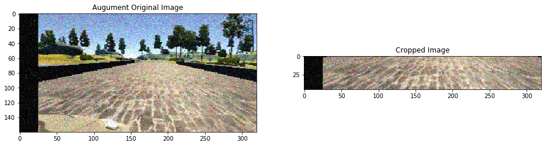


## Step 2: Generator of images and steering angles definition


```python
from sklearn.utils import shuffle
from sklearn.model_selection import train_test_split


samples = lines

train_samples, validation_samples = train_test_split(samples, test_size=0.2)

BATCH_SIZE = 64

def generator(samples, batch_size=32):
    num_samples = len(samples)
    while 1: # Loop forever so the generator never terminates
        shuffle(samples)
        for offset in range(0, num_samples, batch_size):
            batch_samples = samples[offset:offset+batch_size]

#             for batch_sample in batch_samples:
                
            image,label = generatedataset(batch_samples)
                
            X_train,y_train = DataAugumentProcess(image,label)
            
            yield shuffle(X_train, y_train)

# compile and train the model using the generator function
train_generator = generator(train_samples, batch_size=BATCH_SIZE)
validation_generator = generator(validation_samples, batch_size=BATCH_SIZE)
```

## Step 3: Generate ages and steering angles diretly


```python
lines = readindexfromconfig('./data/driving_log.csv')
X_train_base,y_train_base = generatedataset(lines)

print(X_train_base.shape)
print(y_train_base.shape)
```

    (24108, 160, 320, 3)
    (24108,)
    


```python
X_train,y_train = DataAugumentProcess(X_train_base,y_train_base)

print(X_train.shape)
print(y_train.shape)
```


```python
import pickle

train_dataset_file = "gen_train.p"

print("Number of training examples after augmenting and balancing training data =", X_train.shape[0])
pickle.dump({
        "features" : X_train,
        "labels" : y_train
    }, open(train_dataset_file, "wb" ),protocol=4)
print("Generated balanced dataset saved in", train_dataset_file)
```


```python
import pickle

train_dataset_file = "gen_train.p"

with open(train_dataset_file, mode='rb') as f:
    gen_train = pickle.load(f)
    
X_train, y_train = gen_train['features'], gen_train['labels']
print("Number of training examples after augmenting and balancing training data =", X_train.shape[0])
```

    Number of training examples after augmenting and balancing training data = 48216
    

## Step 4: Model Archieture


```python
import keras

from keras.models import Sequential
from keras.layers import Dense, Activation, Flatten, Convolution2D, Dropout,Lambda,MaxPooling2D, Cropping2D
from keras.layers import Conv2D, MaxPooling2D
from keras.models import Model
import matplotlib.pyplot as plt
from keras import regularizers

input_shape=(160,320,3)

model = Sequential()

model.add(Lambda(lambda x:((x /255.0)-0.5),input_shape=input_shape))
model.add(Cropping2D(cropping=((70,25), (0,0))))

# model.add(Conv2D(6, kernel_size=(5, 5),activation='relu'))
# model.add(MaxPooling2D(pool_size=(2, 2)))
# model.add(Conv2D(16, (5, 5), activation='relu'))
# model.add(MaxPooling2D(pool_size=(2, 2)))
# model.add(Dropout(0.25))
# model.add(Flatten())
# model.add(Dense(120, activation='relu'))  
# model.add(Dropout(0.15))
# model.add(Dense(84, activation='relu'))  
# model.add(Dropout(0.05))
# model.add(Dense(1)) 

regr = 0.0005
model.add(Convolution2D(24,(5,5), strides=(2,2), activation='relu',kernel_regularizer=regularizers.l2(regr)))
model.add(Convolution2D(36,(5,5), strides=(2,2), activation='relu',kernel_regularizer=regularizers.l2(regr)))
model.add(Convolution2D(48,(5,5), strides=(2,2), activation='relu',kernel_regularizer=regularizers.l2(regr)))
model.add(Convolution2D(64,(3,3), activation='relu',kernel_regularizer=regularizers.l2(regr)))
model.add(Convolution2D(64,(3,3), activation='relu',kernel_regularizer=regularizers.l2(regr)))
model.add(Dropout(0.5))
model.add(Flatten())
model.add(Dense(100,kernel_regularizer=regularizers.l2(regr)))
model.add(Dropout(0.25))
model.add(Dense(50,kernel_regularizer=regularizers.l2(regr)))
model.add(Dropout(0.25))
model.add(Dense(10,kernel_regularizer=regularizers.l2(regr)))
model.add(Dropout(0.1))
model.add(Dense(1))

model.summary()
```

    Using TensorFlow backend.
    

    _________________________________________________________________
    Layer (type)                 Output Shape              Param #   
    =================================================================
    lambda_1 (Lambda)            (None, 160, 320, 3)       0         
    _________________________________________________________________
    cropping2d_1 (Cropping2D)    (None, 65, 320, 3)        0         
    _________________________________________________________________
    conv2d_1 (Conv2D)            (None, 31, 158, 24)       1824      
    _________________________________________________________________
    conv2d_2 (Conv2D)            (None, 14, 77, 36)        21636     
    _________________________________________________________________
    conv2d_3 (Conv2D)            (None, 5, 37, 48)         43248     
    _________________________________________________________________
    conv2d_4 (Conv2D)            (None, 3, 35, 64)         27712     
    _________________________________________________________________
    conv2d_5 (Conv2D)            (None, 1, 33, 64)         36928     
    _________________________________________________________________
    dropout_1 (Dropout)          (None, 1, 33, 64)         0         
    _________________________________________________________________
    flatten_1 (Flatten)          (None, 2112)              0         
    _________________________________________________________________
    dense_1 (Dense)              (None, 100)               211300    
    _________________________________________________________________
    dropout_2 (Dropout)          (None, 100)               0         
    _________________________________________________________________
    dense_2 (Dense)              (None, 50)                5050      
    _________________________________________________________________
    dropout_3 (Dropout)          (None, 50)                0         
    _________________________________________________________________
    dense_3 (Dense)              (None, 10)                510       
    _________________________________________________________________
    dropout_4 (Dropout)          (None, 10)                0         
    _________________________________________________________________
    dense_4 (Dense)              (None, 1)                 11        
    =================================================================
    Total params: 348,219
    Trainable params: 348,219
    Non-trainable params: 0
    _________________________________________________________________
    

## Step 5: Train Model


```python
def trainmodel(models,X_train_data,y_train_data,lr=0.0005,batch_size=128,epochs=50,patience=10,savefile='model.h5'):
    adam = keras.optimizers.Adam(lr=lr)
    models.compile(loss='mse',optimizer=adam)

    rarlystop = keras.callbacks.EarlyStopping(monitor='val_loss', min_delta=0, patience=patience, verbose=0, mode='auto')

# history_object = model.fit_generator(train_generator, steps_per_epoch=len(train_samples)/BATCH_SIZE, \
#                                      validation_data=validation_generator,validation_steps=len(validation_samples)/BATCH_SIZE, \
#                                      callbacks = [rarlystop],\
#                                      epochs=30)

# history_object = model.fit_generator(train_generator, steps_per_epoch=20, \
#                                      validation_data=validation_generator,validation_steps=10, \
#                                      callbacks = [rarlystop],\
#                                      epochs=30)

    history_object = models.fit(X_train_data, y_train_data, batch_size=128,epochs=epochs,shuffle=True,verbose=1,\
                           validation_split=0.1,callbacks=[rarlystop])  

    models.save(savefile)

    ### print the keys contained in the history object
    print(history_object.history.keys())

    ### plot the training and validation loss for each epoch
    plt.plot(history_object.history['loss'])
    plt.plot(history_object.history['val_loss'])
    plt.title('model mean squared error loss')
    plt.ylabel('mean squared error loss')
    plt.xlabel('epoch')
    plt.legend(['training set', 'validation set'], loc='upper right')
    plt.show()
```


```python
trainmodel(model,X_train,y_train)
```

    Train on 43394 samples, validate on 4822 samples
    Epoch 1/50
    43394/43394 [==============================] - 34s 794us/step - loss: 0.1251 - val_loss: 0.0643
    Epoch 2/50
    43394/43394 [==============================] - 33s 759us/step - loss: 0.0499 - val_loss: 0.0408
    Epoch 3/50
    43394/43394 [==============================] - 34s 773us/step - loss: 0.0367 - val_loss: 0.0336
    Epoch 4/50
    43394/43394 [==============================] - 33s 771us/step - loss: 0.0322 - val_loss: 0.0318
    Epoch 5/50
    43394/43394 [==============================] - 33s 772us/step - loss: 0.0304 - val_loss: 0.0302
    Epoch 6/50
    43394/43394 [==============================] - 33s 770us/step - loss: 0.0291 - val_loss: 0.0312
    Epoch 7/50
    43394/43394 [==============================] - 34s 774us/step - loss: 0.0285 - val_loss: 0.0288
    Epoch 8/50
    43394/43394 [==============================] - 34s 788us/step - loss: 0.0282 - val_loss: 0.0295
    Epoch 9/50
    43394/43394 [==============================] - 34s 777us/step - loss: 0.0283 - val_loss: 0.0285
    Epoch 10/50
    43394/43394 [==============================] - 33s 757us/step - loss: 0.0276 - val_loss: 0.0291
    Epoch 11/50
    43394/43394 [==============================] - 33s 756us/step - loss: 0.0280 - val_loss: 0.0290
    Epoch 12/50
    43394/43394 [==============================] - 33s 757us/step - loss: 0.0274 - val_loss: 0.0297
    Epoch 13/50
    43394/43394 [==============================] - 33s 756us/step - loss: 0.0273 - val_loss: 0.0284
    Epoch 14/50
    43394/43394 [==============================] - 33s 754us/step - loss: 0.0269 - val_loss: 0.0319
    Epoch 15/50
    43394/43394 [==============================] - 33s 756us/step - loss: 0.0273 - val_loss: 0.0278
    Epoch 16/50
    43394/43394 [==============================] - 33s 768us/step - loss: 0.0271 - val_loss: 0.0279
    Epoch 17/50
    43394/43394 [==============================] - 33s 768us/step - loss: 0.0270 - val_loss: 0.0288
    Epoch 18/50
    43394/43394 [==============================] - 33s 758us/step - loss: 0.0269 - val_loss: 0.0288
    Epoch 19/50
    43394/43394 [==============================] - 33s 760us/step - loss: 0.0267 - val_loss: 0.0284
    Epoch 20/50
    43394/43394 [==============================] - 33s 761us/step - loss: 0.0267 - val_loss: 0.0282
    Epoch 21/50
    43394/43394 [==============================] - 33s 758us/step - loss: 0.0266 - val_loss: 0.0287
    Epoch 22/50
    43394/43394 [==============================] - 33s 757us/step - loss: 0.0266 - val_loss: 0.0295
    Epoch 23/50
    43394/43394 [==============================] - 33s 759us/step - loss: 0.0270 - val_loss: 0.0271
    Epoch 24/50
    43394/43394 [==============================] - 33s 757us/step - loss: 0.0265 - val_loss: 0.0282
    Epoch 25/50
    43394/43394 [==============================] - 33s 756us/step - loss: 0.0263 - val_loss: 0.0280
    Epoch 26/50
    43394/43394 [==============================] - 33s 757us/step - loss: 0.0264 - val_loss: 0.0284
    Epoch 27/50
    43394/43394 [==============================] - 33s 766us/step - loss: 0.0262 - val_loss: 0.0270
    Epoch 28/50
    43394/43394 [==============================] - 33s 764us/step - loss: 0.0265 - val_loss: 0.0283
    Epoch 29/50
    43394/43394 [==============================] - 33s 758us/step - loss: 0.0263 - val_loss: 0.0279
    Epoch 30/50
    43394/43394 [==============================] - 33s 759us/step - loss: 0.0266 - val_loss: 0.0286
    Epoch 31/50
    43394/43394 [==============================] - 33s 757us/step - loss: 0.0264 - val_loss: 0.0275
    Epoch 32/50
    43394/43394 [==============================] - 33s 758us/step - loss: 0.0263 - val_loss: 0.0284
    Epoch 33/50
    43394/43394 [==============================] - 33s 756us/step - loss: 0.0262 - val_loss: 0.0365
    Epoch 34/50
    43394/43394 [==============================] - 33s 757us/step - loss: 0.0292 - val_loss: 0.0297
    Epoch 35/50
    43394/43394 [==============================] - 34s 775us/step - loss: 0.0266 - val_loss: 0.0292
    Epoch 36/50
    43394/43394 [==============================] - 33s 769us/step - loss: 0.0264 - val_loss: 0.0278
    Epoch 37/50
    43394/43394 [==============================] - 33s 762us/step - loss: 0.0264 - val_loss: 0.0303
    dict_keys(['val_loss', 'loss'])
    


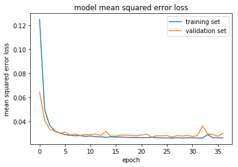


## Step 6: Model Fine tune


```python
import keras
from keras.models import load_model

def finetunemodel(X_train_data,y_train_data,lr=0.0001,loadfile='model.h5'):
    models = load_model(loadfile)
    trainmodel(models,X_train_data,y_train_data,lr=lr,savefile=loadfile)
```


```python
finetunemodel(X_train,y_train,lr=0.0001)
```

    Train on 43394 samples, validate on 4822 samples
    Epoch 1/50
    43394/43394 [==============================] - 33s 766us/step - loss: 0.0251 - val_loss: 0.0268
    Epoch 2/50
    43394/43394 [==============================] - 31s 725us/step - loss: 0.0249 - val_loss: 0.0266
    Epoch 3/50
    43394/43394 [==============================] - 31s 722us/step - loss: 0.0249 - val_loss: 0.0269
    Epoch 4/50
    43394/43394 [==============================] - 32s 727us/step - loss: 0.0247 - val_loss: 0.0267
    Epoch 5/50
    43394/43394 [==============================] - 31s 725us/step - loss: 0.0247 - val_loss: 0.0268
    Epoch 6/50
    43394/43394 [==============================] - 31s 723us/step - loss: 0.0248 - val_loss: 0.0273
    Epoch 7/50
    43394/43394 [==============================] - 31s 724us/step - loss: 0.0247 - val_loss: 0.0264
    Epoch 8/50
    43394/43394 [==============================] - 32s 726us/step - loss: 0.0246 - val_loss: 0.0265
    Epoch 9/50
    43394/43394 [==============================] - 31s 723us/step - loss: 0.0246 - val_loss: 0.0272
    Epoch 10/50
    43394/43394 [==============================] - 31s 723us/step - loss: 0.0246 - val_loss: 0.0273
    Epoch 11/50
    43394/43394 [==============================] - 32s 726us/step - loss: 0.0245 - val_loss: 0.0266
    Epoch 12/50
    43394/43394 [==============================] - 32s 729us/step - loss: 0.0247 - val_loss: 0.0276
    Epoch 13/50
    43394/43394 [==============================] - 31s 724us/step - loss: 0.0245 - val_loss: 0.0272
    Epoch 14/50
    43394/43394 [==============================] - 31s 725us/step - loss: 0.0246 - val_loss: 0.0268
    Epoch 15/50
    43394/43394 [==============================] - 31s 724us/step - loss: 0.0244 - val_loss: 0.0269
    Epoch 16/50
    43394/43394 [==============================] - 32s 727us/step - loss: 0.0244 - val_loss: 0.0266
    Epoch 17/50
    43394/43394 [==============================] - 32s 728us/step - loss: 0.0247 - val_loss: 0.0266
    dict_keys(['val_loss', 'loss'])
    


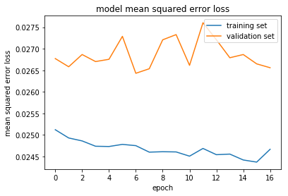


## Step 7: Simulator test

#### Saving a video of the autonomous agent

Creates a video based on images found in the `run1` directory. The name of the video will be the name of the directory followed by `'.mp4'`, so, in this case the video will be `run1.mp4`.

```
python drive.py model.h5 run1

python video.py run1
```


```python
from IPython.display import HTML

video_output = 'run1.mp4'

HTML("""
<video width="320" height="160" controls>
  <source src="{0}">
</video>
""".format(video_output))
```


<video width="320" height="160" controls>
  <source src="run1.mp4">
</video>


## Step 7: Model Fine tuned to another jungle dataset


```python
lines = readindexfromconfig('./windows_sim/data/driving_log.csv')
X_train_base,y_train_base = generatedataset(lines,'')

print(X_train_base.shape)
print(y_train_base.shape)
```

    (37182, 160, 320, 3)
    (37182,)
    


```python
X_train,y_train = DataAugumentProcess(X_train_base,y_train_base)

print(X_train.shape)
print(y_train.shape)
```

    (74364, 160, 320, 3)
    (74364,)
    


```python
finetunemodel(X_train,y_train,lr=0.0001)
```

    Train on 66927 samples, validate on 7437 samples
    Epoch 1/50
    66927/66927 [==============================] - 71s 1ms/step - loss: 0.1138 - val_loss: 0.1326
    Epoch 2/50
    66927/66927 [==============================] - 48s 710us/step - loss: 0.1130 - val_loss: 0.1315
    Epoch 3/50
    66927/66927 [==============================] - 48s 711us/step - loss: 0.1133 - val_loss: 0.1315
    Epoch 4/50
    66927/66927 [==============================] - 48s 712us/step - loss: 0.1124 - val_loss: 0.1289
    Epoch 5/50
    66927/66927 [==============================] - 47s 708us/step - loss: 0.1126 - val_loss: 0.1293
    Epoch 6/50
    66927/66927 [==============================] - 47s 706us/step - loss: 0.1125 - val_loss: 0.1303
    Epoch 7/50
    66927/66927 [==============================] - 47s 700us/step - loss: 0.1118 - val_loss: 0.1324
    Epoch 8/50
    66927/66927 [==============================] - 47s 704us/step - loss: 0.1120 - val_loss: 0.1287
    Epoch 9/50
    66927/66927 [==============================] - 47s 700us/step - loss: 0.1118 - val_loss: 0.1303
    Epoch 10/50
    66927/66927 [==============================] - 47s 707us/step - loss: 0.1114 - val_loss: 0.1315
    Epoch 11/50
    66927/66927 [==============================] - 47s 706us/step - loss: 0.1111 - val_loss: 0.1289
    Epoch 12/50
    66927/66927 [==============================] - 47s 706us/step - loss: 0.1115 - val_loss: 0.1324
    Epoch 13/50
    66927/66927 [==============================] - 47s 705us/step - loss: 0.1111 - val_loss: 0.1292
    Epoch 14/50
    66927/66927 [==============================] - 47s 705us/step - loss: 0.1109 - val_loss: 0.1321
    Epoch 15/50
    66927/66927 [==============================] - 47s 706us/step - loss: 0.1106 - val_loss: 0.1409
    Epoch 16/50
    66927/66927 [==============================] - 47s 708us/step - loss: 0.1107 - val_loss: 0.1312
    Epoch 17/50
    66927/66927 [==============================] - 47s 702us/step - loss: 0.1103 - val_loss: 0.1325
    Epoch 18/50
    66927/66927 [==============================] - 48s 712us/step - loss: 0.1104 - val_loss: 0.1292
    dict_keys(['val_loss', 'loss'])
    


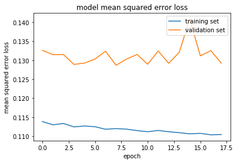


#### Saving a video of the autonomous agent

```
python drive.py model.h5 run2

python video.py run2
```


```python
video_output = 'run2.mp4'

HTML("""
<video width="320" height="160" controls>
  <source src="{0}">
</video>
""".format(video_output))
```


<video width="320" height="160" controls>
  <source src="run2.mp4">
</video>


